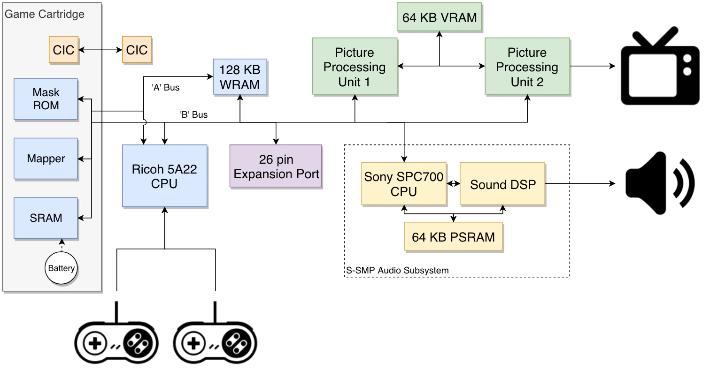

# toysnes

Toy SNES emulator written in Rust.

## Architecture

From: [Super Nintendo Architecture](https://www.copetti.org/writings/consoles/super-nintendo/)

## References

- [Fullsnes](https://problemkaputt.de/fullsnes.htm)
